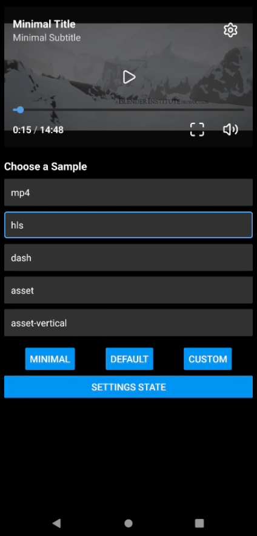
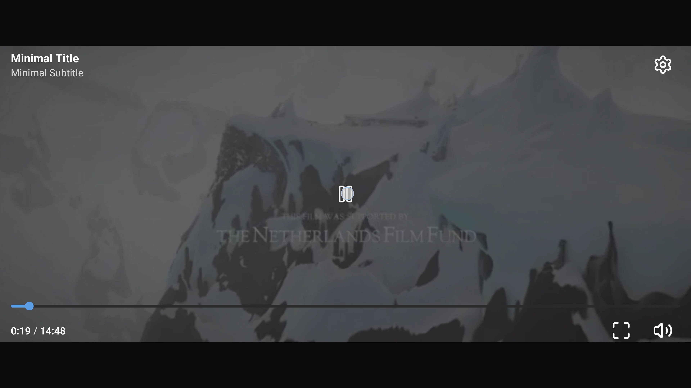
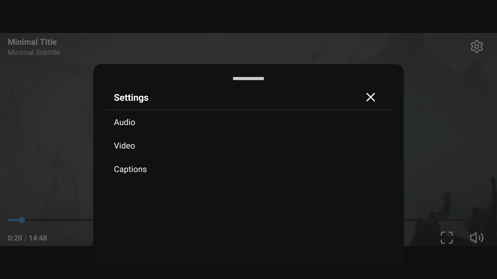

<h1 align="centre">react-native-video-toolkit</h1>

My **first ever real OSS project** 😭. Be kind, I’m still figuring this out.<br>
A flexible and customizable video player UI toolkit for React Native, designed for a great mobile viewing experience (and maybe TV one day… if I survive).

<a href="https://www.npmjs.com/package/react-native-video-toolkit">
  
</a>
<a href="https://github.com/2004durgesh/react-native-video-toolkit/blob/main/LICENSE">
  
</a>
<a href="https://github.com/2004durgesh/react-native-video-toolkit/actions/workflows/ci.yml">
  
</a>
<a href="https://github.com/2004durgesh/react-native-video-toolkit/actions/workflows/docs.yml">
  
</a>
<a href="https://discord.gg/n7xVPxbG4R">
  
</a>

---

## 📱 Demo

| Mode                          | Preview                                               |
| ----------------------------- | ----------------------------------------------------- |
| **Portrait**                  |  |
| **Landscape**                 |     |
| **Landscape (with settings)** |     |

---

## ✨ Features

- **Fully Customizable UI** – Build your own video player experience with modular components.
- **Theming Support** – Light, dark, or your own custom theme.
- **Pre-built Layouts** – Includes `DefaultLayout` and `MinimalLayout` to get started quickly.
- **Gesture Handling** – Tap, double-tap, and other common playback gestures.
- **Rich Component Library** – Controls like `PlayButton`, `ProgressBar`, `TimeDisplay`, `FullscreenButton`, `MuteButton`, and more.
- **Hooks-based API** – Access player state and control playback, settings, and gestures.

---

## ✅ Platform Compatibility

| Platform   | Tested |
| ---------- | :----: |
| Android    |   ✅   |
| iOS        |   ❌   |
| Android TV |   ✅   |
| Apple TV   |   ❌   |
| Web        |   ✅   |

---

## 🗺️ Roadmap

- [x] Core Player component
- [x] Customizable controls
- [x] Theming support
- [x] Layout presets (`DefaultLayout`, `MinimalLayout`)
- [ ] TV support (D-pad navigation)
- [ ] Picture-in-Picture (PiP) mode
- [ ] More advanced layouts (YouTube/Netflix-style)

---

## 📦 Installation

```bash
npm install react-native-video-toolkit
# or
yarn add react-native-video-toolkit
```

---

## 🚀 Usage

```tsx
import { VideoPlayer } from 'react-native-video-toolkit';
import { MinimalLayout } from 'react-native-video-toolkit/layouts';

const App = () => {
  return (
    <VideoPlayer source={{ uri: 'https://example.com/video.mp4' }}>
      <MinimalLayout />
    </VideoPlayer>
  );
};
```

For more docs:
👉 [Documentation website](https://2004durgesh.github.io/react-native-video-toolkit/).

---

## 🐛 Issues

Yes, there are bugs. Probably lots.
👉 [Open an issue](https://github.com/2004durgesh/react-native-video-toolkit/issues).
It makes the project look active, so actually… thanks in advance.

---

## 🤝 Contributing

Wanna help? Please? 🙏
Check the [contributing guide](CONTRIBUTING.md). I’ll try to review your PR before I spiral into existential dread.

---

## 📜 License

MIT – because lawyers are scary.

---

Made with [create-react-native-library](https://github.com/callstack/react-native-builder-bob)
Thanks to [wuxnz](https://github.com/wuxnz) for motivation (and maybe trauma)

Made with ❤️, caffeine, and way too many Chrome tabs by [Durgesh](https://github.com/2004durgesh)
